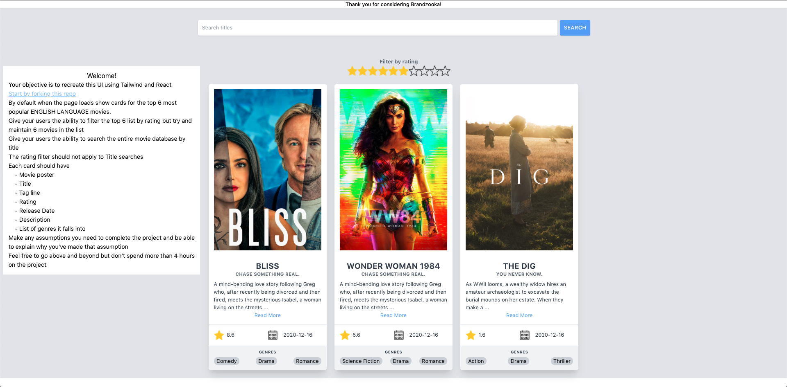

# bz-hiring
brandzooka-hiring

When finished please create a pull request and email jgarner@brandzooka.com.

### API Documentation
https://www.themoviedb.org/documentation/api
https://developers.themoviedb.org.

          
#### Your objective is to recreate this UI using Tailwind and React
Start by forking this repo.   
<b>We will provide you with an API key for themoviedb.org</b>
          
By default when the page loads show cards for the top 6 most popular ENGLISH LANGUAGE movies.

          
Give your users the ability to filter the top 6 list by rating but try and maintain 6 movies in the list

          
Give your users the ability to search the entire movie database by title

          
The rating filter should not apply to Title searches

          
Each card should have <ul>
            <li>&nbsp;&nbsp;&nbsp;Movie poster</li>
            <li>&nbsp;&nbsp;&nbsp;Title</li>
            <li>&nbsp;&nbsp;&nbsp;Tag line</li>
            <li>&nbsp;&nbsp;&nbsp;Rating</li>
            <li>&nbsp;&nbsp;&nbsp;Release Date</li>
            <li>&nbsp;&nbsp;&nbsp;Description</li>
            <li>&nbsp;&nbsp;&nbsp;List of genres it falls into</li>
            </ul>

          
There are some basic assets in `src/assets/` but feel free to swap them out if you want

          
Make any assumptions you need to complete the project and be able to explain why you've made that assumption

          
Feel free to go above and beyond but don't spend more than 4 hours on the project

        

